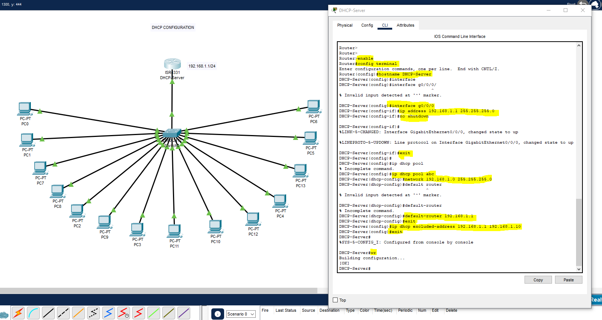
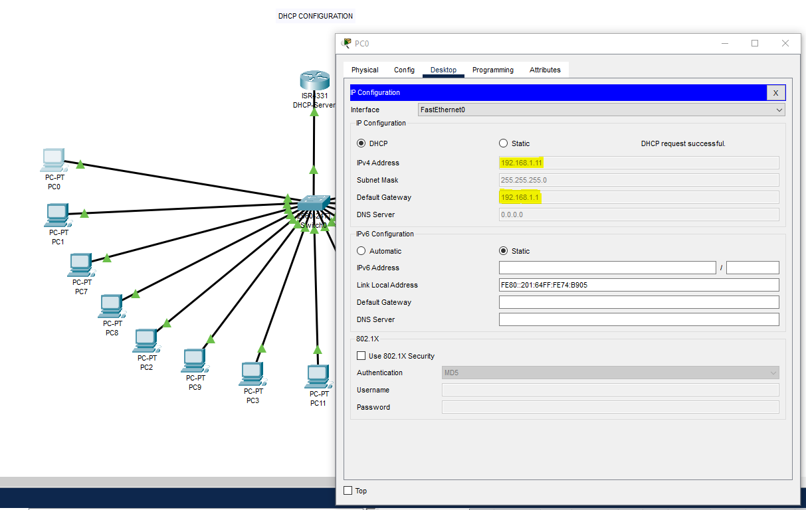
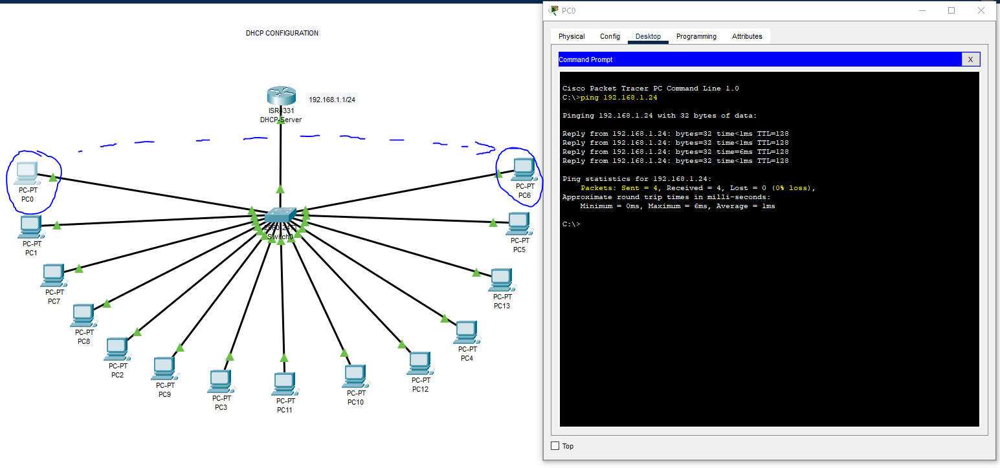
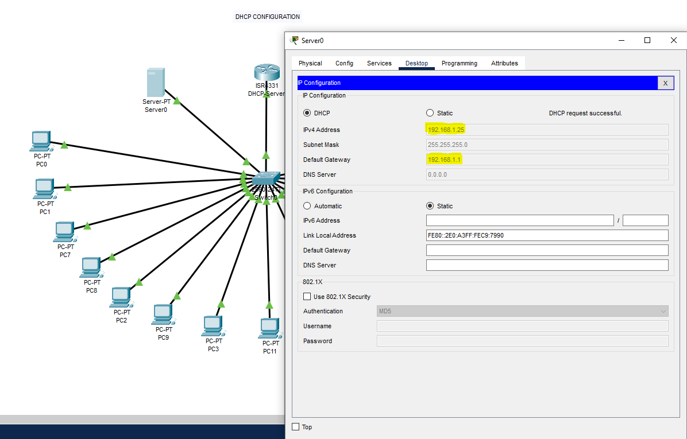
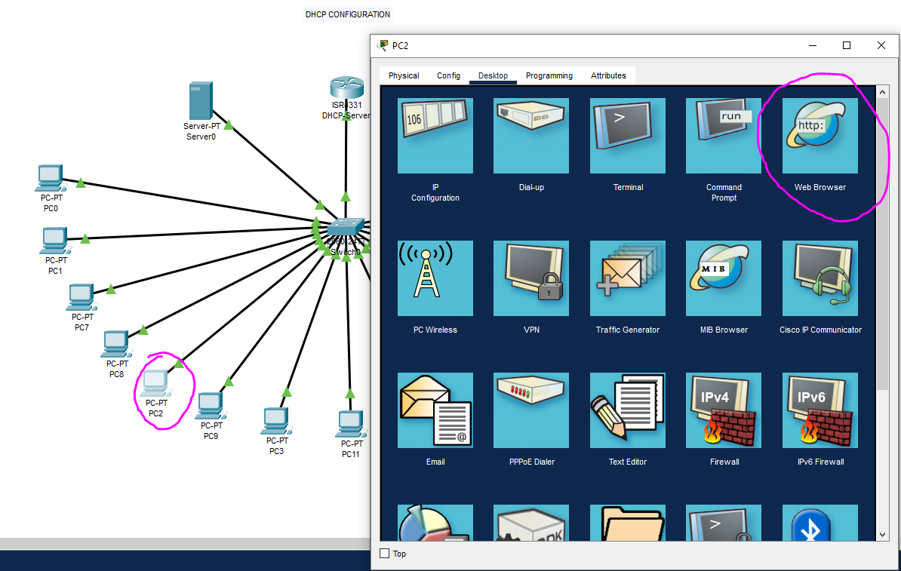
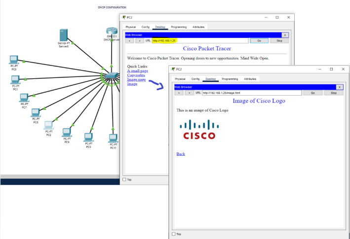

# DHCP-Server-LAN-CiscoPT-Lab

## Opis laboratorium

Laboratorium przedstawia konfigurację serwera DHCP na routerze Cisco w środowisku Cisco Packet Tracer oraz weryfikację działania usług sieciowych w sieci LAN. Celem ćwiczenia jest automatyczne przydzielanie adresów IP komputerom w sieci oraz sprawdzenie komunikacji między urządzeniami i dostępności usług webowych.

---

## Topologia sieci

- **Router ISR 331** skonfigurowany jako serwer DHCP.
- **Switch** łączący router z wieloma komputerami PC oraz serwerem.
- **Komputery PC** (PC0–PC13) oraz **Server0** podłączone do switcha.
- **Server0** pełniący rolę serwera WWW.

---

## Konfiguracja DHCP na routerze

Konfiguracja serwera DHCP została wykonana w CLI routera Cisco, zgodnie z poniższymi krokami:

1. **Konfiguracja interfejsu routera**:
    - Adres IP: `192.168.1.1`
    - Maska podsieci: `255.255.255.0`
2. **Utworzenie puli DHCP**:
    - Nazwa puli: `abc`
    - Sieć: `192.168.1.0 255.255.255.0`
    - Brama domyślna: `192.168.1.1`
3. **Wykluczenie adresów z puli DHCP**:
    - Wykluczone adresy: `192.168.1.1` do `192.168.1.10`
4. **Zakończenie konfiguracji**.

---

## Automatyczne pobieranie adresów IP przez urządzenia

Komputery w sieci otrzymują adresy IP automatycznie z serwera DHCP. Przykładowo:

- PC0 otrzymał adres: `192.168.1.11`, maskę: `255.255.255.0`, bramę: `192.168.1.1`
  
Analogicznie do pozostałych urządzeń, wykluczając jednak pule adresów od 192.168.1.1 do 192.168.1.10, gdzie 192.168.1.1 to router/brama domyślna.

  

---

## Sprawdzenie komunikacji między urządzeniami 

W celu sprawdzenia komunikacji należy wejść do danego command prompt'u komputera i zpingować adres IP innego urządzenia w sieci LAN, z tej samej puli adresów wydanych przez DHCP.

---

## Dostęp do serwera WWW 

Można również zauważyć, że serwer dostał także przydzielone ip z puli DHCP routera i uzyskano dostęp do serwera WWW, wpisując w przeglądarce adres IP serwera. Wybierając opcję np. image -> wyświetliła się strona powitalna oraz obrazek logo Cisco.

---

## Wnioski

- DHCP na routerze Cisco umożliwia automatyczną konfigurację adresów IP w sieci lokalnej, co upraszcza zarządzanie adresacją.
- Komputery oraz serwer w sieci poprawnie otrzymują adresy IP, maskę oraz bramę domyślną.
- Usługi sieciowe, takie jak serwer WWW, są dostępne dla klientów w sieci.
- Test ping potwierdza poprawną komunikację między urządzeniami.
